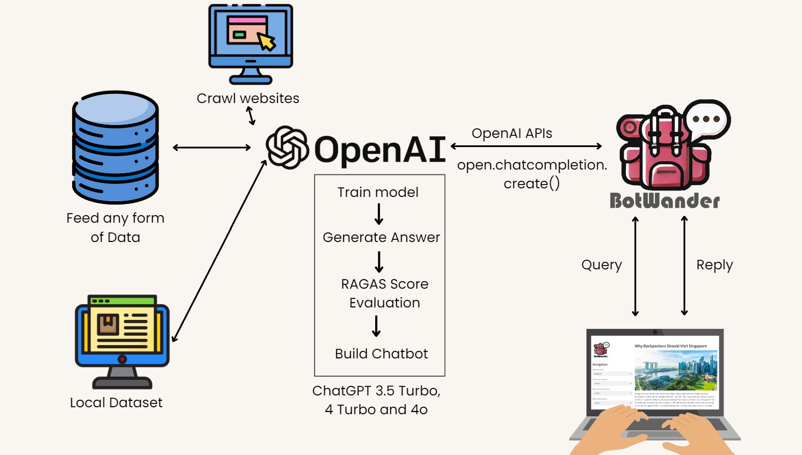

# BotWander-Backpacker-Travel-Planning-App
 - [Background](#Background)
 - [Problem Statement](#Problem-Statement)
 - [App Features & Usage](#App-Features-and-Usage)
 - [Technology Stack](#Technology-Stack)
 - [Machine Learning Evaluation](#Machine-Learning-Evaluation)
 - [Conclusion](#Conclusion)
 
## Background

This app is designed to help backpackers efficiently plan their travels. It combines country selection, interest exploration, real-time itinerary viewing, and route optimization, all within an easy-to-navigate interface. The app also includes a chatbot powered by OpenAI GPT-3.5 Turbo, offering personalized assistance for any travel-related questions.

## Problem Statement
Backpackers often encounter challenges when sourcing travel information from various platforms, making the trip planning process inefficient and time-consuming. Additionally, finding cost-effective accommodation that fits their budget can be difficult. Furthermore, most standard travel itineraries are too generic, failing to cater to individual preferences and interests, which diminishes the overall travel experience.

The Backpacker Travel Planning App tackles these problems by:

- Offering country and interest selection to explore destinations.
- Providing a real-time view of the itinerary via an embedded Google Doc (using an iframe).
- Optimizing public transport routes with the Google Maps API.
- Integrating an AI chatbot that answers questions, budget planning and recommendation of accomodation in real time.

## App Features & Usage

Country Selection:
Users can choose their destination from a variety of countries, such as Singapore, Malaysia, Thailand, Vietnam, and Indonesia.
This feature is accessible through a dropdown list, allowing backpackers to quickly select the countries they plan to explore.

Interests Exploration:
Tailored recommendations are generated for various interests like sketching, nature exploration, photography, and more, based on the selected destination.
Users can explore activities aligned with their passions, helping them make the most of their trip.

Itinerary Planning:
The app includes a real-time itinerary viewing feature, where users can plan their days using an embedded Google Doc (via an iframe).
The itinerary is updated in real time, ensuring users can always access and modify their plans on the go.

Route Optimization:
Using the Google Maps API, the app helps users find the best public transportation routes between destinations.
This feature optimizes travel time and helps backpackers navigate efficiently through their chosen locations.

AI Chatbot Support:
Powered by OpenAI GPT-3.5 Turbo, the chatbot provides real-time travel advice and answers to user queries.
Located on the right side of the app, the chatbot assists with questions about travel plans, interests, or routes, ensuring users have up-to-date information during their journey.

## Technology Stack

- Frontend: Streamlit
- Backend: Python, OpenAI API, Google API
- Real-Time Itinerary Integration: Embedded Google Doc (iframe)
- AI Chatbot: OpenAI GPT-3.5 Turbo for real-time assistance

## Machine Learning Evaluation

For enhanced chatbot responses, I trained a dataset with travel-related questions and answers, using OpenAI’s machine learning models to generate answers. Here’s how I evaluated the models:

Models Used: GPT-3.5 Turbo, GPT-4 Turbo, GPT-4 Omni
Evaluation Metric: RAGAS Score (Relevancy and Faithfulness)
Relevancy: How relevant the chatbot responses were to the original query.
Faithfulness: How accurate the chatbot’s responses were based on the provided data.

Findings:
GPT-3.5 Turbo: This model provided the best RAGAS score in terms of both relevancy and faithfulness while maintaining excellent real-time response speed. Given these factors, GPT-3.5 Turbo was selected for running the chatbot in this app.
GPT-4 Turbo and GPT-4 Omni: While these models offered competitive performance and slightly better RAGAS scores for certain queries, their response times were slower, making them less suitable for real-time assistance in this app's use case.

## Conclusion

BotWander Backpacker Travel Planning App integrates cutting-edge technology to make travel planning easy and efficient for backpackers. Through the combination of country and interest selection, real-time itinerary planning, route optimization, and an AI chatbot, users can enjoy a streamlined travel experience. By leveraging GPT-3.5 Turbo for real-time AI support, the app ensures that backpackers receive quick, accurate, and relevant travel assistance throughout their journey.
